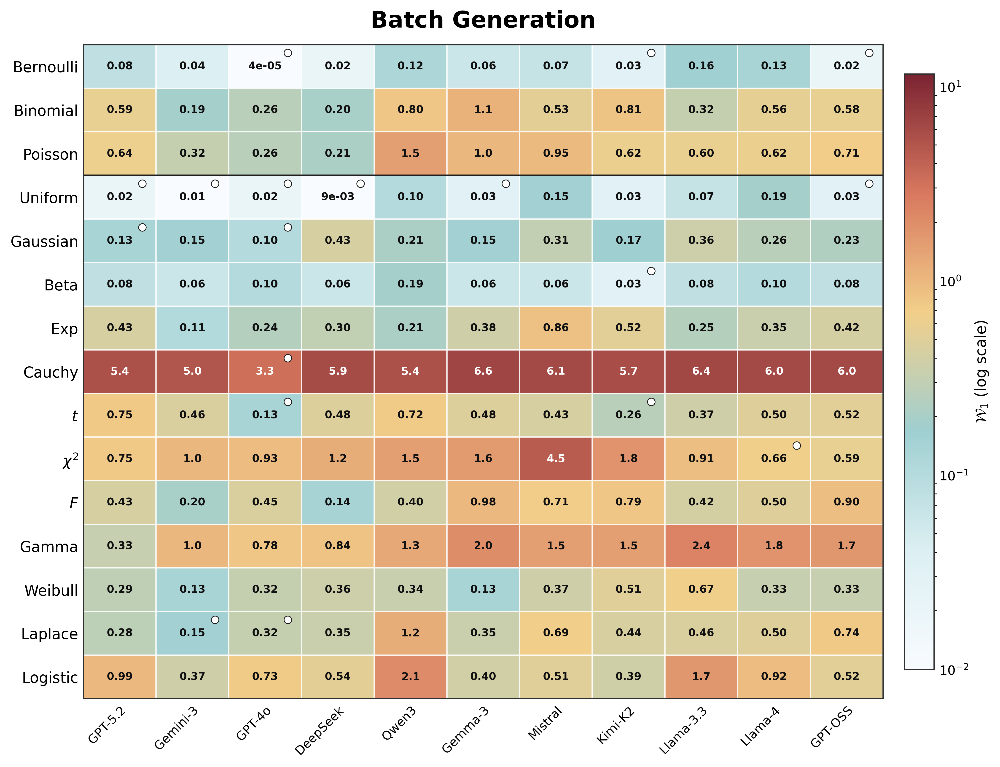
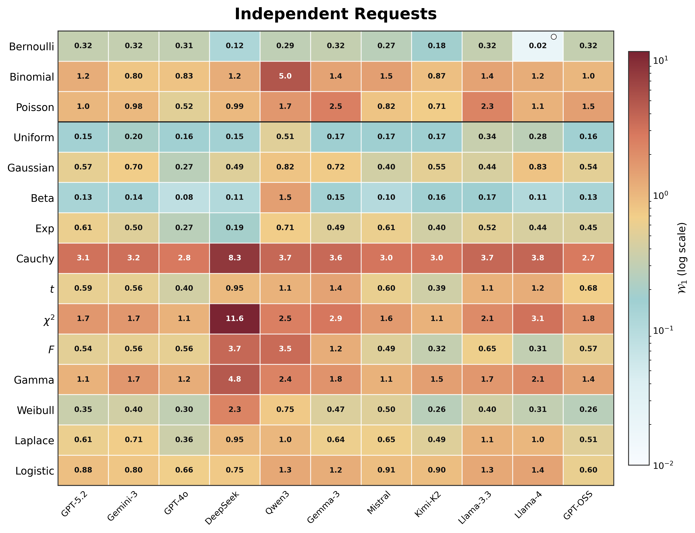
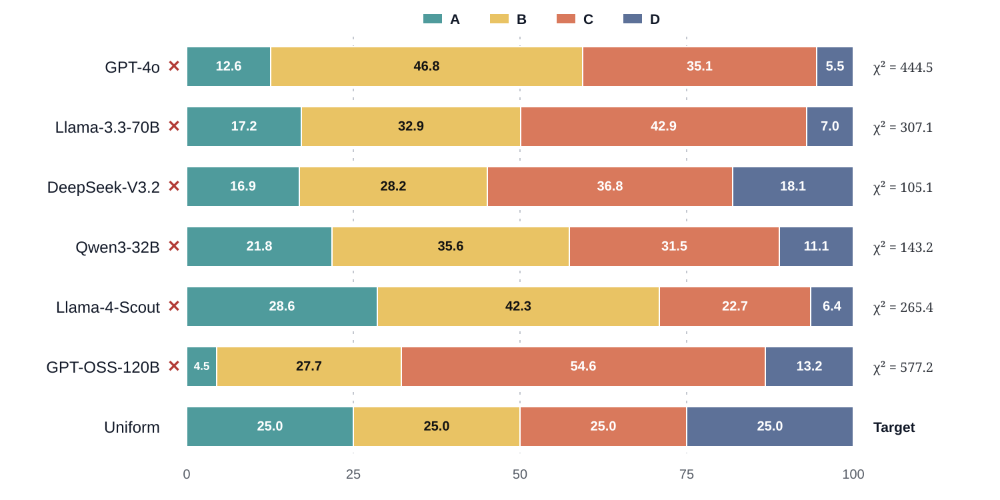

<div align="center">

# 🎲 Large Language Models Are Bad Dice Players

### LLMs Struggle to Generate Random Numbers from Statistical Distributions

**Minda Zhao · Yilun Du · Mengyu Wang**<br>
**Harvard University**

<a href="https://2026.aclweb.org/"></a>

The official implementation and data release for our ACL 2026 paper.

[**Paper**](https://aclanthology.org/2026.acl-long.1051/) |
[**PDF**](https://aclanthology.org/2026.acl-long.1051.pdf) |
[**DOI**](https://doi.org/10.18653/v1/2026.acl-long.1051) |
[**Code & Data**](https://github.com/Mininda/LLM_Bad_Dice_Player)

</div>

## 📝 Citation

If you use this code, the released prompts, or the data in your research, please cite our paper:

```bibtex
@inproceedings{zhao-etal-2026-large,
    title = "Large Language Models Are Bad Dice Players: {LLM}s Struggle to Generate Random Numbers from Statistical Distributions",
    author = "Zhao, Minda and Du, Yilun and Wang, Mengyu",
    booktitle = "Proceedings of the 64th Annual Meeting of the Association for Computational Linguistics (Volume 1: Long Papers)",
    month = jul,
    year = "2026",
    address = "San Diego, California, United States",
    publisher = "Association for Computational Linguistics",
    url = "https://aclanthology.org/2026.acl-long.1051/",
    doi = "10.18653/v1/2026.acl-long.1051",
    pages = "22942--22959"
}
```

Machine-readable citation metadata are also available in [`CITATION.cff`](CITATION.cff).

## 🔎 Overview

Can a large language model natively sample from a specified probability distribution without calling an external numerical tool? We audit this capability at scale across **11 frontier LLMs**, **15 distributions**, and **1,000 samples per configuration**.

The benchmark separates two settings:

- **Batch Generation:** one response contains all 1,000 requested samples.
- **Independent Requests:** 1,000 stateless calls each produce one sample.

The released benchmark uses Wasserstein-1 distance for distributional fidelity, two-sample Kolmogorov–Smirnov tests for continuous distributions, and chi-square goodness-of-fit tests for discrete distributions, with `alpha = 0.01`.

### 🔑 Main findings

- Batch generation achieves only modest validity: the median model passes **7%** of the 15 distributions, and the strongest model passes **40%**.
- Independent requests nearly collapse: **10 of 11 models pass none** of the distributions.
- Sampling fidelity worsens as distributional complexity and the sampling horizon increase.
- The same failure propagates into applications: all evaluated models show significant answer-position bias in MCQ generation and violate target distributions in attribute-constrained text-to-image prompt generation.
- For applications requiring statistical guarantees, use an external, validated sampler rather than relying on native LLM sampling.

### 📊 Main benchmark pass rates

| Model | Batch Generation | Independent Requests |
|:--|--:|--:|
| GPT-5.2 | 13% | 0% |
| Gemini-3 | 13% | 0% |
| **GPT-4o** | **40%** | 0% |
| DeepSeek-V3.2 | 7% | 0% |
| Qwen3 | 0% | 0% |
| Gemma-3 | 7% | 0% |
| Mistral-3.2 | 0% | 0% |
| Kimi-K2 | 20% | 0% |
| Llama-3.3 | 0% | 0% |
| Llama-4 | 7% | **7%** |
| GPT-OSS | 13% | 0% |

A pass means that the corresponding statistical test does not reject the target distribution at `alpha = 0.01`. See Tables 2–3 and 9 in the paper for Wasserstein-1 distances and tier-level results.

### 🌡️ Wasserstein-1 results

Each cell reports Wasserstein-1 distance (lower is better); circles mark configurations that pass the corresponding statistical test at `alpha = 0.01`. Colors use a logarithmic scale.

<div align="center">
  
  <br>
  
</div>

### 🎯 MCQ answer-position bias

For the downstream medical MCQ experiment, each model generated `N = 1000` questions under an explicit instruction to distribute correct answers uniformly across A/B/C/D. All six models still deviated significantly from the 25% target (`p < 0.001`).

<div align="center">
  
</div>

The bars report the percentage of correct answers assigned to each option; the red crosses mark rejection of the uniform target. GPT-OSS-120B shows the strongest skew toward option C (54.6%), while GPT-4o favors option B (46.8%). See Table 4 in the paper.

## 📦 Released artifacts

This repository includes the code, exact prompt templates, raw model outputs, reference samples, and processed summaries used by the release:

```text
configs/
  distributions.json        distribution definitions and paper parameters
  protocols.json            batch, independent, and sample-size settings
  evaluation.json           tests, metrics, alpha, and reference seed
  models.template.json      model registry without credentials
  downstream_tasks.json     MCQ and attribute-task settings

prompts/
  batch/                    15 batch-generation prompts
  independent/              15 independent-request prompts
  downstream/               MCQ and attribute-generation prompts

data/
  raw_results/
    batch/                  released batch outputs
    independent/            released independent-request outputs
  reference/                aligned NumPy/SciPy reference samples
  downstream/
    mcq/raw_outputs/        released MCQ outputs
    attributes/joint/       released joint-attribute outputs
    attributes/independent/ released single-attribute outputs
  processed/
    recomputed_main_results.json
    downstream/downstream_results.json

manifests/                  source and prompt provenance manifests
assets/                     README figures
docs/paper_contract.md      canonical reproducibility settings
src/                        generation, parsing, metrics, and release checks
scripts/validate_release.sh one-command local validation
```

For a quick look at the published results, start with:

- [`data/processed/recomputed_main_results.json`](data/processed/recomputed_main_results.json) for the main batch and independent benchmark.
- [`data/processed/downstream/downstream_results.json`](data/processed/downstream/downstream_results.json) for MCQ and attribute-constrained generation.
- [`docs/paper_contract.md`](docs/paper_contract.md) for the canonical experiment settings.

## 🚀 Quick start

```bash
git clone https://github.com/Mininda/LLM_Bad_Dice_Player.git
cd LLM_Bad_Dice_Player

python -m venv .venv
source .venv/bin/activate
python -m pip install --upgrade pip
pip install -r requirements.txt

bash scripts/validate_release.sh
```

The validation command checks Python syntax, required release files, prompt counts, accidental secret patterns, processed-result structure, and the headline pass rates reported in the paper. It does not make API calls.

## 🔁 Re-running generation

Generation requires credentials for the providers you use. The scripts read environment-variable names from [`configs/models.template.json`](configs/models.template.json); no credentials are stored in the repository.

```bash
export OPENAI_API_KEY=...
export DEEPINFRA_API_KEY=...
export GEMINI_API_KEY=...
```

Provider model identifiers and availability may change over time. Check `configs/models.template.json` before launching a new run and update only the relevant `api_model` or `base_url` entry when necessary.

### 🎲 Main distribution benchmark

Batch generation:

```bash
python src/generate_samples.py \
  --protocol batch \
  --model GPT-4o \
  --distribution Gaussian \
  --n-samples 1000 \
  --output-dir outputs/main
```

Independent requests:

```bash
python src/generate_samples.py \
  --protocol independent \
  --model GPT-4o \
  --distribution Uniform \
  --n-samples 1000 \
  --output-dir outputs/main
```

Valid distribution keys are listed in [`configs/distributions.json`](configs/distributions.json). Valid model display names are listed in [`configs/models.template.json`](configs/models.template.json).

### 🧩 Downstream tasks

MCQ generation:

```bash
python src/generate_downstream.py \
  --task mcq \
  --model GPT-4o \
  --n-samples 1000 \
  --output-dir outputs/downstream
```

Joint attribute-constrained prompt generation:

```bash
python src/generate_downstream.py \
  --task joint_attribute \
  --model DeepSeek-V3.2 \
  --n-samples 1000 \
  --output-dir outputs/downstream
```

Single-attribute follow-up:

```bash
python src/generate_downstream.py \
  --task independent_height \
  --model GPT-OSS \
  --n-samples 1000 \
  --output-dir outputs/downstream
```

Other supported tasks are `independent_gender`, `independent_race`, and `independent_color`. The downstream runner uses 32 concurrent workers by default; reduce this with `--max-workers` if required by your provider's rate limits.

> [!IMPORTANT]
> An independent run with `--n-samples 1000` makes 1,000 model API calls. Review provider pricing and rate limits before running large experiments.

## 🧪 Benchmark design

| Tier | Distributions |
|:--|:--|
| Tier I — fundamental | Uniform, Gaussian, Bernoulli |
| Tier II — bounded/counting | Beta, Binomial, Poisson, Exponential |
| Tier III — heavy-tailed/complex | Cauchy, Student's t, Chi-Square, F-Distribution, Gamma, Weibull, Laplace, Logistic |

All main experiments use `N = 1000`, `temperature = 1.0`, and `top_p = 1.0`. Reference samples use a fixed seed of `42`. The exact parameters and evaluation choices live in [`configs/`](configs/) rather than being duplicated in the runners.

## 🏷️ License

This repository is released under the [Apache License 2.0](LICENSE).
